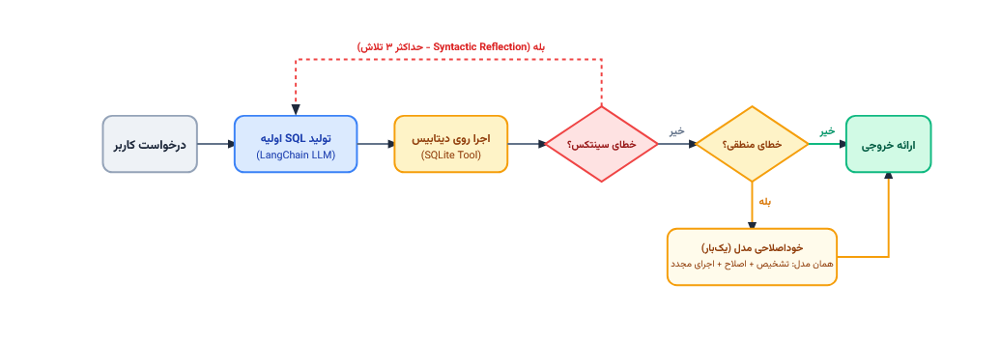

# Bank SQL Agent

A Text-to-SQL agent for a banking database, built with **LangGraph**. Converts Persian user queries into SQL, self-corrects syntax errors up to 3 times, runs a single semantic check on the result, and streams the final answer back to the user.

<p align="center">
  
</p>

## Project Structure

```text
bank-sql-agent/
├── README.md
├── .gitignore
├── .env.example
├── requirements.txt
├── bank_database.db
└── src/
    └── bank_sql_agent/
        ├── __init__.py        # Package version
        ├── __main__.py        # Entry point (python -m bank_sql_agent)
        ├── main.py            # Interactive CLI loop + file logging
        ├── config.py          # .env loading and database path
        ├── database.py        # SQLDatabase connection + schema text
        ├── llm.py             # LLM initialization
        ├── prompts/           # Prompts for each stage (generate/fix/check/finalize)
        ├── chains/            # LangChain chains for each prompt
        ├── tools/             # SQL execution tool
        ├── graph/             # State, nodes, and StateGraph
        ├── ui/                # Terminal colors/icons + Tee logger
        └── utils/             # Shared helpers (e.g., SQL output cleanup)
```

## Agent Architecture (LangGraph)

```text
generate_sql → execute_sql ⇄ fix_syntax   (max 3 attempts, real graph loop)
                    │
                    ▼ (on success)
              semantic_check              (runs once, no back edges)
                    │
        ┌───────────┴───────────┐
        ▼                       ▼
  semantic_execute          finalize
        │                       │
        └───────────┬───────────┘
                    ▼
                 answer (final response, streamed)
```

- **Syntactic path**: a real graph loop (`execute_sql` ⇄ `fix_syntax`), controlled by an `attempt` counter against `max_syntactic_attempts`.
- **Semantic path**: no back edges — the graph is topologically unable to loop at this stage.
- **Tool execution**: the only tool in the project is the SQL executor. It is called directly from code, not by the model's autonomous tool-calling.

## Installation & Usage

```bash
# 1. Install dependencies
pip install -r requirements.txt

cd src
python -m bank_sql_agent
```

To exit the interactive loop, type `exit` or `خروج`.

Each session writes a log file named `sql_agent_log_YYYYMMDD_HHMMSS.txt` in the working directory. ANSI color codes are stripped so the log stays readable in any text editor.

## Model Configuration

The project uses an OpenAI-compatible endpoint (e.g., a Gemini proxy). Base URL and API key are set in `.env` — see `llm.py` → `init_llm`.

## Database

`bank_database.db` must be in the project root (next to `src/`). Schema details are also generated by `database.py` → `get_schema_text`.

### Data Dictionary

#### `Customer` — Primary Key: `CustomerID`

Stores customer identity and registration records.

| Column        | Type    | Constraints                     |
| ------------- | ------- | ------------------------------- |
| `CustomerID`  | INTEGER | PRIMARY KEY                     |
| `NationalID`  | TEXT    | NOT NULL, UNIQUE                |
| `FirstName`   | TEXT    | NOT NULL                        |
| `LastName`    | TEXT    | NOT NULL                        |
| `BirthDate`   | TEXT    | Nullable                        |
| `PhoneNumber` | TEXT    | Nullable                        |
| `CreatedAt`   | TEXT    | Registration date               |

#### `Account` — Primary Key: `AccountID`

Tracks customers' checking and savings accounts.

| Column          | Type    | Constraints / Notes                       |
| --------------- | ------- | ----------------------------------------- |
| `AccountID`     | INTEGER | PRIMARY KEY                               |
| `CustomerID`    | INTEGER | FOREIGN KEY → `Customer`                  |
| `AccountNumber` | TEXT    | NOT NULL, UNIQUE                          |
| `AccountType`   | TEXT    | Values: `'Savings'`, `'Checking'`         |
| `Balance`       | REAL    | Current balance                           |
| `Status`        | TEXT    | Values: `'Active'`, `'Inactive'`          |

#### `Transaction` — Primary Key: `TransactionID`

Records all financial transactions: deposits, withdrawals, interest, fees, and payments.

| Column            | Type    | Constraints / Notes                                                            |
| ----------------- | ------- | ------------------------------------------------------------------------------ |
| `TransactionID`   | INTEGER | PRIMARY KEY                                                                    |
| `AccountID`       | INTEGER | FOREIGN KEY → `Account`                                                        |
| `TransactionType` | TEXT    | Values: `'Deposit'`, `'Withdrawal'`, `'Interest'`, `'Fee'`, `'Payment'`        |
| `Amount`          | REAL    | Transaction amount                                                             |
| `Description`     | TEXT    | Free-text description                                                          |

#### `Transfer` — Primary Key: `TransferID`

Stores direct peer-to-peer transfers between source and destination accounts.

| Column          | Type    | Constraints / Notes                    |
| --------------- | ------- | -------------------------------------- |
| `TransferID`    | INTEGER | PRIMARY KEY                            |
| `FromAccountID` | INTEGER | FOREIGN KEY → `Account(AccountID)`     |
| `ToAccountID`   | INTEGER | FOREIGN KEY → `Account(AccountID)`     |
| `Amount`        | REAL    | Transfer amount                        |

